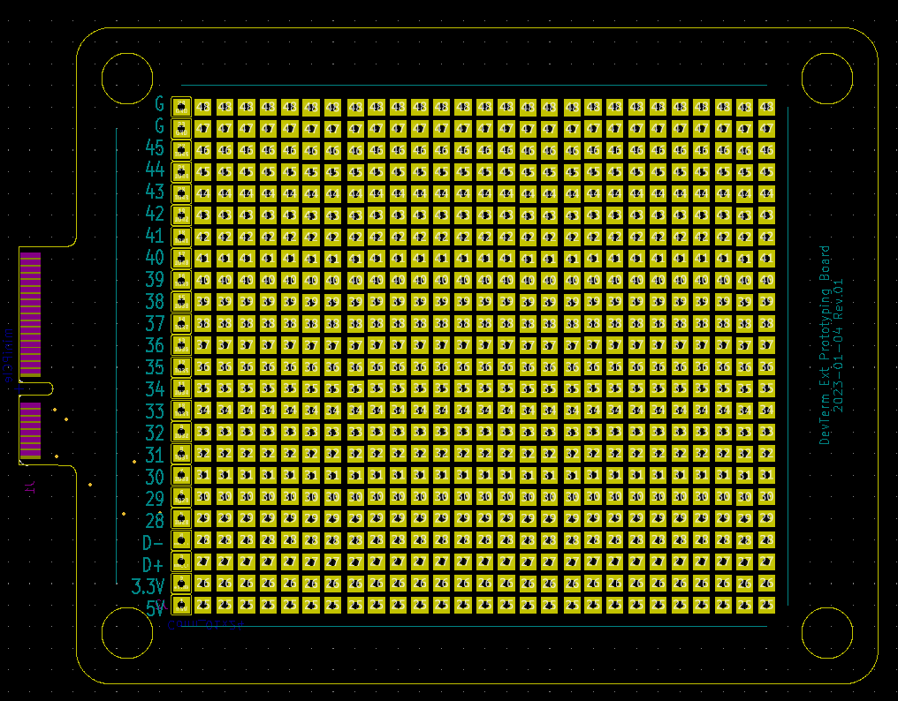

# KiCad DevTerm Ext Prototype Board
 This is a prototype board for DevTerm Ext Board.
 
 This PCB offer all of the GPIO in the ext port and one USB port. All of the avaliable port is wired to the first column of the prototype area.
## Usage
This repository contain JLCPCB manufacture files. You can order the board from [JLCPCB](https://jlcpcb.com/).

> The manufacture files is in `jlcpcb` folder
## Include
This template is build base on the public DXF file and the ext board schedmatic that released by the clockworkPi and import into the kicad 6. A mini-PCIE footprint is included in the template.